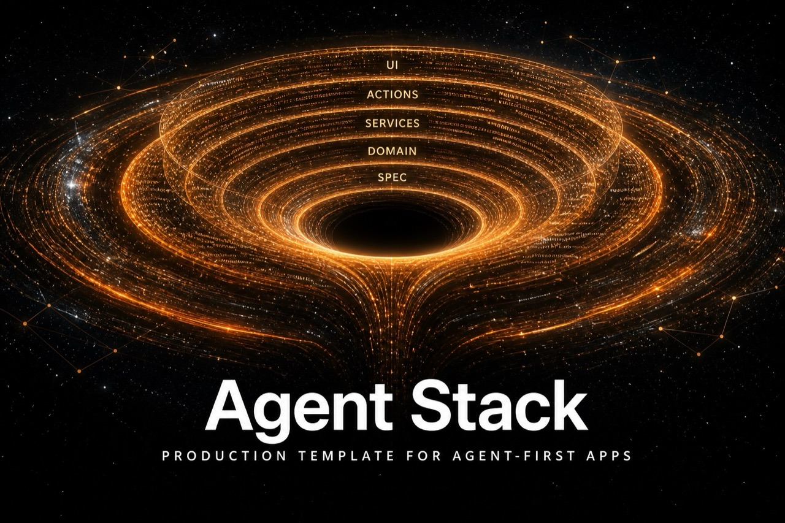

<div align="center">



A production-shaped starting point for a multi-tenant web application, built so
coding agents produce consistent work without being told the same things twice.

<p>
  <a href="https://github.com/krivoox/agent-stack-template"></a>
  
  
  
  
  = 20.11" />
  
  
  <a href="https://github.com/krivoox/agent-stack-template/releases"></a>
  <a href="./LICENSE"></a>
</p>

Conventions live in files an agent reads automatically — `AGENTS.md`,
`.cursor/rules/`, `.cursor/agents/`, `docs/` — not in a person's head.

The included `projects` feature is a **reference vertical slice**. Read it,
copy its shape, then delete it.

</div>

## What you get

| Layer | Contents |
|-------|----------|
| Agent OS | Rules, sub-agents, skills, stop hook, PR template |
| Docs | Architecture, stack, TDD, ADRs, specs, guides |
| App | Next.js App Router, Better Auth, Prisma, PostgreSQL |
| Tenancy | Workspace + membership roles from day one |
| Design | Semantic tokens, mobile-first shell, light/dark |
| CI | Typecheck, lint, test, build, commitlint, changelog, release |

## Prerequisites

- Node.js ≥ 20.11
- A PostgreSQL database (local, or [Supabase](https://supabase.com))
- GitHub CLI (`gh`) if you use the init script to create the remote

## Quick start

```bash
# 1. Clone / use as GitHub template
git clone <this-repo> my-app && cd my-app

# 2. Rename the product (name, description, package)
npm run init -- --name "My App" --slug my-app

# 3. Environment
cp .env.example .env.local
# Fill DATABASE_URL, DIRECT_URL, BETTER_AUTH_SECRET

# 4. Install, migrate, run
npm install
npm run db:migrate
npm run dev
```

Open [http://localhost:3000](http://localhost:3000).

## Init script

`scripts/init.mjs` rewrites the placeholder identity in one pass:

| Flag | Effect |
|------|--------|
| `--name "My App"` | `APP_NAME`, docs titles, auth `appName` |
| `--slug my-app` | `package.json` name, `APP_SHORT_NAME` |
| `--description "…"` | Manifest / meta description |
| `--repo owner/name` | Optional: create a GitHub repo and push (`--private` for private) |

```bash
npm run init -- --name "Acme Ops" --slug acme-ops --repo your-user/acme-ops
```

## Scripts

| Script | Purpose |
|--------|---------|
| `npm run dev` | Next.js development server |
| `npm run verify` | typecheck + lint + test |
| `npm run test` | Vitest (domain only) |
| `npm run db:migrate` | Prisma migrate (dev) |
| `npm run db:studio` | Prisma Studio |
| `npm run changelog` | Refresh `[Unreleased]` |
| `npm run release:dry` | Show the next SemVer bump |

## How to work here

1. Read [AGENTS.md](./AGENTS.md) — classify the work, then follow the matching
   guide.
2. Branch from `develop`: see [docs/guides/git-flow.md](./docs/guides/git-flow.md).
3. Features: spec **Accepted** or **Shipped** → domain test → domain →
   service → action → UI
   ([new-feature.md](./docs/guides/new-feature.md)). Bugs, refactors and chores
   have their own playbooks under `docs/guides/`.
4. Open a PR against `develop`. CI must be green.

## Changelog and releases

Versions follow [SemVer](https://semver.org/). Every production tag is a
[GitHub Release](https://github.com/krivoox/agent-stack-template/releases);
the full history is [CHANGELOG.md](./CHANGELOG.md).

Push to `develop` refreshes `[Unreleased]`. Merging `develop` into `main`
bumps the version, tags `vX.Y.Z` and publishes the Release. How that is
derived from Conventional Commits:
[docs/guides/changelog.md](./docs/guides/changelog.md).

## Contributing

The GitHub **Contributing** tab is [CONTRIBUTING.md](./CONTRIBUTING.md).
Questions and ideas go to
[Discussions](https://github.com/krivoox/agent-stack-template/discussions);
bugs and product changes go to
[Issues](https://github.com/krivoox/agent-stack-template/issues/new/choose).

### Contributors

<a href="https://github.com/krivoox/agent-stack-template/graphs/contributors">
  
</a>

Anyone whose commit lands on the default branches appears there and on
[Insights → Contributors](https://github.com/krivoox/agent-stack-template/graphs/contributors).

## Documentation map

Not a reading order. Classify in [AGENTS.md](./AGENTS.md), then open one guide.

| File | Contents |
|------|----------|
| [docs/README.md](./docs/README.md) | Index |
| [docs/architecture.md](./docs/architecture.md) | Layers, auth, data, performance |
| [docs/stack.md](./docs/stack.md) | Fixed stack |
| [docs/tdd-workflow.md](./docs/tdd-workflow.md) | What is and isn't tested |
| [docs/domain-model.md](./docs/domain-model.md) | Entities and invariants |
| [docs/adr/](./docs/adr/) | Architecture decisions |
| [docs/specs/](./docs/specs/) | Feature specs |
| [docs/guides/](./docs/guides/) | Feature, bug, refactor, chore playbooks |
| [DESIGN.md](./DESIGN.md) | Visual system |

## License

[MIT](./LICENSE). Forks and products generated from this template may keep
that licence or replace it.
